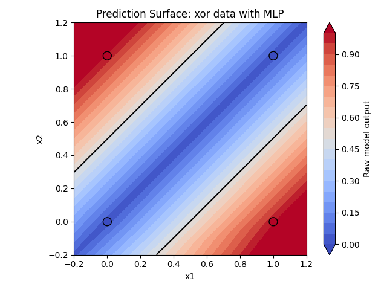
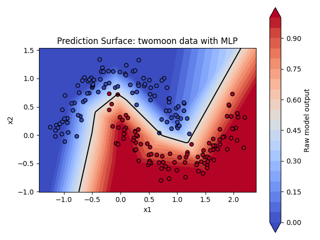

# Growing-AI

Growing-AI is a small, NumPy-first learning project for understanding how automatic differentiation and neural-network training work below framework-level APIs. The repository builds a scalar autograd engine, a NumPy-backed `Tensor`, basic neural-network components, and several toy experiments that connect forward computation, reverse-mode differentiation, parameter updates, and observable training behavior.

This is an educational implementation, not a production deep-learning framework or a replacement for PyTorch.

## Why this project?

High-level frameworks make model construction convenient, but that convenience can hide the mechanisms that make training possible. This project implements a deliberately small stack so those mechanisms remain inspectable:

- how operations create a computation graph;
- how local derivatives compose through the chain rule;
- why gradients from multiple graph paths must accumulate;
- how broadcasted values receive gradients in their original shapes;
- how layers expose parameters to an optimizer; and
- how a training loop connects data, loss, `backward()`, and SGD.

NumPy provides array storage and numerical kernels. The graph construction, gradient rules, traversal, layer composition, loss, optimizer, datasets, and training loop are implemented in this repository.

## What is implemented

### Automatic differentiation

- A scalar `Value` engine for basic arithmetic and reverse-mode differentiation.
- A NumPy-backed `Tensor` with `float64` data and same-shaped gradient storage.
- Arithmetic operations: addition, subtraction, negation, multiplication, division, and scalar powers.
- Two-dimensional matrix multiplication.
- Reductions with `sum()` and `mean()`; the current branch also supports `sum(axis=..., keepdims=...)`.
- Differentiable `exp()`, `log()`, ReLU, and Leaky ReLU operations.
- Reverse topological traversal from a scalar output.
- Gradient accumulation when a value contributes through multiple graph paths.
- Gradient shape reduction for broadcasted addition and multiplication.

### Neural-network and training components

- `Linear`: affine transformation `x @ weight + bias` with parameter discovery.
- `Sequential`: ordered forward composition and flattened parameter collection.
- `MLP`: configurable stacks of `Linear` layers and hidden `LeakyReLU` activations.
- `LeakyReLU` and composition-based `Sigmoid` activation objects.
- Mean squared error in `Trainer`.
- Per-sample SGD with explicit `zero_grad()` and `step()` operations.
- Seeded experiment assembly with independently selected datasets and `linear` or `mlp` models.
- Loss-curve plotting for every experiment and two-dimensional prediction-surface plotting for XOR and Two Moons.

### Included experiments

| Dataset | Purpose | Current setup |
| --- | --- | --- |
| `linear` | End-to-end affine training sanity check | Three samples with three input features |
| `nonlinear` | Compare Linear and MLP capacity on `y = x^2` | Nine one-dimensional samples |
| `xor` | Show the limitation of a linear boundary and the effect of a hidden layer | Four binary-labelled points |
| `twomoon` | Learn a curved boundary on a reproducible noisy toy dataset | 200 two-dimensional samples |

The XOR and Two Moons runs currently optimize raw scalar outputs with MSE. A value of `0.5` can be used as an inspection threshold, but the repository does not yet provide a complete binary-classification pipeline with BCE, calibrated probabilities, a train/test split, or generalization metrics.

See [docs/experiments.md](docs/experiments.md) for commands, verified observations, interpretation limits, and suitable next experiments.

### Experiment snapshots

The figures below were generated with the repository's default MLP configurations. They show training samples, raw model output, and the `0.5` inspection boundary; they are not test-set evaluations.

**XOR — four training points**



**Two Moons — 200 noisy training points**



## How it works

### Computation graph

Each operation performs its NumPy forward calculation immediately and returns a new `Tensor`. The result stores its parent tensors in `_prev`, an operation label in `_op`, and a local `_backward` closure containing that operation's derivative rule.

For example, a linear layer creates this data flow:

```text
X: (batch, in_features)
  @ W: (in_features, out_features)
  + b: (out_features,)
  -> Y: (batch, out_features)
```

The bias is broadcast in the forward pass. During backward propagation, its gradient is summed back to `(out_features,)`.

### Backward and gradient propagation

`Tensor.backward()` only accepts a scalar output. It recursively builds a topological ordering of the reachable graph, clears gradients within that graph, seeds the output gradient with `1`, and executes local backward functions in reverse order.

Local rules add into parent gradients with `+=`. This is essential for expressions such as `x * x + x`, where the same tensor affects the result through more than one path. Clearing the reachable graph before each pass also makes repeated calls on the same loss produce the same gradients instead of accumulating across separate backward calls.

### Broadcasting and shapes

NumPy performs broadcasting during forward addition and multiplication. `_unbroadcast_grad()` reverses that shape expansion by summing extra leading axes and axes whose original dimension was `1`. Matrix multiplication is intentionally limited to two-dimensional tensors, keeping its gradient rules explicit:

```text
dX = dY @ W.T
dW = X.T @ dY
```

## Quick start

Python 3.9 or newer is required by the current type-hint syntax. The repository is not packaged, so run commands from the project root.

```bash
python3 -m venv .venv
source .venv/bin/activate
python3 -m pip install -r requirements.txt
python3 -m unittest discover -s tests -v
```

Run an experiment by selecting a dataset and model independently:

```bash
python3 -m src.main --dataset nonlinear --model linear
python3 -m src.main --dataset nonlinear --model mlp
python3 -m src.main --dataset xor --model mlp
python3 -m src.main --dataset twomoon --model mlp
```

Each command prints epoch losses, final parameters, and predictions, then saves a timestamped log-scale loss curve under `plots/`. XOR and Two Moons also save a prediction-surface figure with the raw model output and a `0.5` inspection boundary. If Matplotlib cannot use its default cache directory, set `MPLCONFIGDIR` to a writable directory before running the command.

## Minimal autograd example

This example follows the current API from tensor creation through a scalar loss and backward propagation:

```python
from src.autograd.tensor import Tensor

x = Tensor([[1.0, 2.0], [3.0, 4.0]])
weight = Tensor([[2.0], [-1.0]])
bias = Tensor([0.5])
target = Tensor([[0.0], [0.0]])

prediction = x @ weight + bias
loss = ((prediction - target) ** 2).mean()
loss.backward()

print(loss.data)     # 3.25
print(weight.grad)   # [[ 8.], [11.]]
print(bias.grad)     # [3.]
```

## Project structure

```text
.
├── src/
│   ├── autograd/
│   │   ├── engine.py       # Scalar Value graph and backward pass
│   │   └── tensor.py       # NumPy Tensor operations and gradients
│   ├── nn/                 # Linear, activations, and Sequential
│   ├── models/mlp.py       # MLP assembly from reusable layers
│   ├── datasets/           # Four small in-repository datasets
│   ├── configs/            # Dimensions, seeds, epochs, and learning rates
│   ├── optimizers/sgd.py   # Parameter updates and gradient reset
│   ├── trainers/trainer.py # MSE and the train/evaluate loop
│   ├── experiments.py      # Dataset/model/config assembly
│   ├── visualization.py    # Two-dimensional prediction surfaces
│   └── main.py             # Command-line entry point and plot orchestration
├── tests/                  # Unit tests for autograd, layers, MLP, and loss
└── docs/                   # Architecture, experiment, roadmap, and study notes
```

The module boundaries are intentionally simple: datasets provide samples, models perform forward computation, the trainer owns the training sequence, and the optimizer only updates parameters.

## Tests

The current suite contains 39 `unittest` cases. It checks:

- scalar arithmetic, chain rule behavior, and shared-node accumulation;
- Tensor arithmetic, scalar-backward enforcement, and repeatable backward passes;
- broadcasted addition and multiplication gradients;
- matrix-multiplication values, gradient values, and gradient shapes;
- reduction, ReLU, Leaky ReLU, exponential, and logarithm derivatives;
- Linear input validation, forward values, backward values, and parameter identity;
- MLP output shape, parameter collection, and seeded initialization; and
- MSE forward and backward behavior.

Run the full suite with:

```bash
python3 -m unittest discover -s tests -v
```

## Current limitations

- This is a learning implementation with a small API and no compatibility or performance guarantees.
- `Tensor.backward()` requires a scalar root; custom upstream gradients are not supported.
- Matrix multiplication supports only two-dimensional tensors.
- The trainer performs online, per-sample SGD; it has no mini-batching or data loader.
- MSE is the only training loss. BCE and CrossEntropy are not implemented.
- Binary-labelled experiments use raw outputs rather than probability-calibrated predictions.
- Experiment reporting is training-set only; there is no train/validation/test split.
- There is no model serialization, device abstraction, packaging metadata, or CI configuration.
- Type hints exist in a few interfaces but are not comprehensive.

## Roadmap

The next steps are deliberately limited to gaps visible in the current code and experiment path:

1. Complete targeted tests for axis-aware `Tensor.sum()` forward and backward behavior.
2. Add a properly evaluated binary-classification path: Sigmoid/BCE, explicit accuracy, and a held-out split for XOR-style and Two Moons experiments.
3. Build and verify numerically stable Softmax/CrossEntropy on small synthetic logits before connecting a multiclass dataset.
4. Add finite-difference gradient checks for representative Tensor and layer parameters.

Larger topics in the project's learning direction should be added only after their required tensor operations, losses, interfaces, and tests exist.

## Learning goals

The project favors small, inspectable implementations over broad API coverage. A component is useful here when its mathematical rule, data flow, engineering responsibility, and verification method can all be explained from the repository itself.
